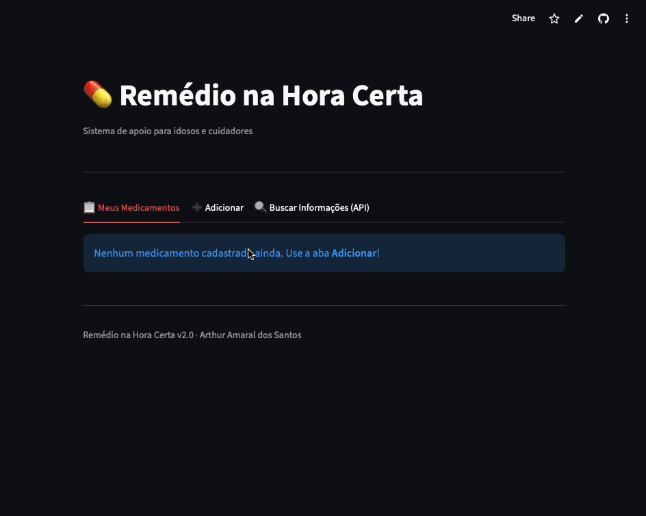

# 💊 Remédio na Hora Certa

## 🌐 Acesse a aplicação online

---

---
## 🌐 Acesse a aplicação online
🔗 [Clique aqui para acessar a aplicação](https://remedio-na-hora-da53fnmuojr6kthrbzq9d5.streamlit.app/)



## 📋 Descrição do Problema Real

O esquecimento de horários de medicamentos é um problema real que pode comprometer a saúde e a qualidade de vida de muitas pessoas. Isso acontece com frequência entre idosos, cuidadores, pessoas com doenças crônicas e pacientes que fazem uso contínuo de remédios. A falta de controle pode causar doses esquecidas, administração duplicada, falhas no tratamento e agravamento do quadro clínico.

## 💡 Proposta da Solução

O **Remédio na Hora Certa** auxilia no controle de medicamentos de forma simples e prática. A aplicação permite cadastrar remédios, visualizar a lista dos medicamentos registrados, marcar quais já foram tomados, remover registros e consultar informações oficiais sobre medicamentos em tempo real.

## 👥 Público-Alvo

- Idosos
- Cuidadores
- Pessoas com doenças crônicas
- Pacientes em uso contínuo de medicamentos

---

## ✨ Funcionalidades

- Cadastro de medicamentos com nome e horário
- Listagem dos medicamentos cadastrados
- Marcação de medicamento como tomado
- Remoção de medicamento
- **🆕 Consulta de informações via API pública OpenFDA** (nome genérico, fabricante, finalidade e advertências)
- Interface visual no terminal (CLI) e versão web (Streamlit)

## 🔌 Integração com API Pública

A aplicação consome a **API pública OpenFDA** (`api.fda.gov`), mantida pelo governo dos Estados Unidos. A integração permite buscar informações sobre medicamentos em tempo real sem necessidade de cadastro ou chave de acesso.

---

## 🛠️ Tecnologias Utilizadas

- Python 3.9+
- Rich
- Requests
- Streamlit
- Pytest
- Pylint
- GitHub Actions (CI/CD)

---

## 🚀 Instalação e Execução

### Pré-requisitos
- Python 3.9 ou superior
- pip

### Passo a Passo

```bash
# Clone o repositório
git clone https://github.com/ArthurAmaral17/Remedio-na-hora.git

# Acesse a pasta
cd Remedio-na-hora

# Instale as dependências
pip3 install rich pytest requests streamlit pylint

# Execute o CLI
python3 -m src.cli

# Ou execute a versão web
streamlit run app_web.py
```

---

## 🧪 Testes

O projeto possui **10 testes automatizados** — 5 unitários e 5 de integração.

```bash
python3 -m pytest tests/ -v
```

Saída esperada: 10 testes passando ✅

---

## 🔍 Lint

```bash
pylint src
```

---

## 📁 Estrutura do Projeto

```
Remedio-na-hora/
├── src/
│   ├── cli.py          # Interface de linha de comando
│   ├── services.py     # Lógica de negócio
│   ├── models.py       # Modelo de dados
│   └── drug_info.py    # Integração com API OpenFDA
├── tests/
│   ├── test_services.py         # Testes unitários
│   └── test_integracao_api.py   # Testes de integração
├── app_web.py          # Versão web (Streamlit)
├── requirements.txt
└── README.md
```

---

## 👤 Autor

**Arthur Amaral dos Santos**

## 🔗 Links

- [Repositório GitHub](https://github.com/ArthurAmaral17/Remedio-na-hora)
- [Aplicação Online](https://remedio-na-hora-da53fnmuojr6kthrbzq9d5.streamlit.app/)
