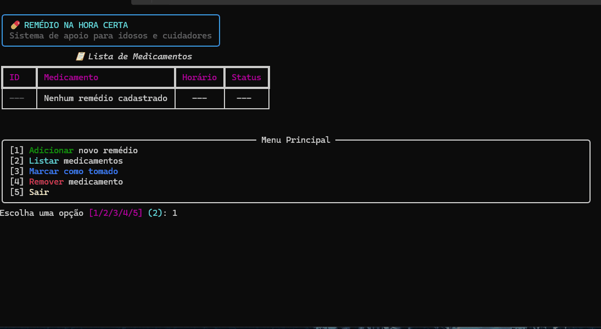

# 💊 Remédio na Hora Certa

<p align="center">
  
</p>

<p align="center">
  
  
  
</p>

---

## 📌 Sobre

O **Remédio na Hora Certa** é uma aplicação CLI feita para ajudar no controle de medicamentos, evitando esquecimentos e erros na rotina de tratamento.

Pensado principalmente para:
- idosos  
- cuidadores  
- pessoas com uso contínuo de medicamentos  

---

## 🎯 Problema

Esquecer horários de remédios ou tomar doses duplicadas é mais comum do que parece — e pode gerar complicações sérias.

---

## 🚀 Solução

Uma ferramenta simples no terminal que permite:

- cadastrar medicamentos  
- visualizar lista com status  
- marcar como tomado  
- remover itens  

Tudo rápido, direto e sem depender de internet.

---

## ⚙️ Funcionalidades

- Cadastro de medicamentos com horário  
- Listagem em tabela (Rich)  
- Marcação de dose como tomada  
- Remoção de medicamentos  

---

## 🛠️ Tecnologias

- Python 3.10+
- Rich
- Pytest
- Pylint

---

## 🚀 Instalação

```bash
git clone https://github.com/ArthurAmaral17/remedio-na-hora.git
cd remedio-na-hora
pip install -r requirements.txt
▶️ Execução
python src/cli.py
🧪 Testes
pytest
✅ Lint
pylint src tests
🔢 Versão
1.0.0
```

👨‍💻 Autor

Arthur Amaral

📄 Licença

MIT
